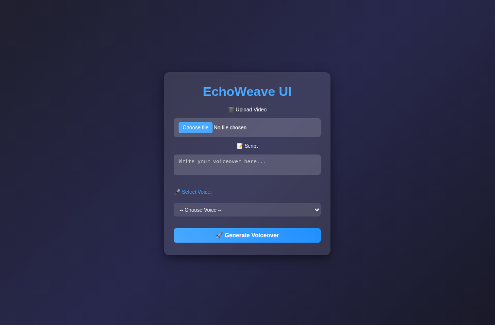

# 📘 EchoWeave

**EchoWeave** is a smart, lightweight tool that lets users add natural AI-generated voiceovers to silent videos. It takes your video, a script, and a preferred voice/style, then returns a fully synced, downloadable video — all in a single click.

### ✨ Features

* Generate **human-like AI voices** using MURF AI
* Automatically **merge audio with video** using MoviePy
* Support for **re-download** without re-generating
* **SHA256 hash-based caching** to avoid redundant API calls
* Optimized React frontend with `useCallback` and `memo`
* Flask backend using `uv` as a Python package manager

### ⚙️ Tech Stack

* Frontend: React (Vite + Tailwind)
* Backend: Flask (Python 3.12)
* Text-to-Speech: MURF AI
* Audio/Video Processing: MoviePy
* Dependency Management: uv
* Hashing: SHA256 (for caching and filename uniqueness)

### 🔧 Setup Instructions

1. **Clone the project**
   `git clone https://github.com/your-username/echo-weave.git`

2. **Open in two VS Code windows**
   One for the frontend, one for the backend
   `code frontend` and `code backend`

---

#### Frontend Setup

* Make sure Node.js version is 20 or higher
* Run the following commands:
  `npm install`
  `npm run dev`

---

#### Backend Setup

* Install `uv` if not already installed: `pip install uv`
* Then run:
  `uv venv`
  `uv run app.py`

This will automatically install dependencies and launch the Flask server.

---

#### Frontend Page

### 🧠 Caching System

EchoWeave hashes a combination of `text + voice + style` using SHA256. If an identical request is made again, it retrieves the audio from cache instead of re-calling the MURF API. This saves time and reduces API costs.

---

### 🛠 Common Issues and Fixes

* **Browser “Failed to fetch” error**
  *Fix:* Add proper MIME type to the Flask response.

* **MoviePy errors on Windows (related to ffmpeg)**
  *Fix:* Downgrade Python from 3.14 to 3.12.

* **Incompatible `.mp3` files**
  *Fix:* Use `.wav` format instead for better compatibility.

* **Mismatch between video and audio durations**
  *Fix:* Ensure voice is generated to match video duration exactly.

* **Voice re-generated unnecessarily**
  *Fix:* Provide a separate download button to fetch the result again without a new request.

---

### 🗺 Directory Structure

* `frontend/` — React app
* `backend/` — Flask app with all processing logic

---
