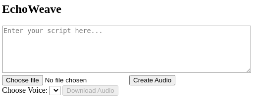

# EchoWeave

EchoWeave is a simple yet powerful tool that transforms muted video into audible form by adding audio from the provided text. It is designed to bridge the gap between written and audiovisual communication, making content more accessible and expressive.

✨ Features

* Convert any textual content into spoken audio using TTS (Text-to-Speech) of MURF AI.
* Accepts user input through a web frontend.
* Cross-platform setup using uv (Python package manager) for consistent environments.

📦 Technologies Used

* Python
* flask
* pyttsx3 for offline text-to-speech
* Frontend using HTML/CSS/JS (you can plug into any frontend)


🚀 Getting Started

Follow the steps below to get the project running on your machine. These instructions are compatible with Windows, macOS, and Linux.

🔧 Prerequisites

Make sure you have Python 3.11+ installed.

Check with:

```bash
python --version
```

If you don't have Python, download it from: [https://www.python.org/downloads/](https://www.python.org/downloads/)

📦 Install uv (Universal Virtualenv)

uv is a fast Python package manager and virtual environment manager. Install it globally:

On Linux/macOS:

```bash
curl -Ls https://astral.sh/uv/install.sh | sh
```

On Windows (PowerShell):

```powershell
powershell -ExecutionPolicy ByPass -c "irm https://astral.sh/uv/install.ps1 | iex"
```

Or using pipx (cross-platform):

```bash
pipx install uv
```

To verify:

```bash
uv --version
```

📥 Running the Server

Once uv is installed, run below these for working backend:

```bash
code backend
uv run app.py
```

This installs all necessary Python packages using uv and starts server.

📥 Running the Client

- Now start the frontend using live server or live preview, the index.html file
- You will see this interface
